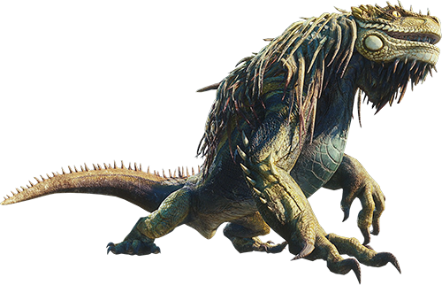
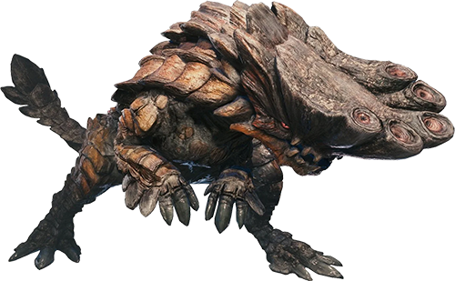

<!-- great jargras Modal -->

      

        

          
        

        

          

            <h2>Great Jargras</h2>
            
<i class="ph ph-x"></i>

          

          

            

              <h3>World information</h3>
              
The pack leader of the Jagras. When hungry, Great Jagras are known to attack monsters even stronger than
                themselves. It
                balloons to unbelievable proportions after swallowing prey.

            

            

              <h3>Weakness</h3>
              
Each <i class="ph-fill ph-star" style="color: #f0ff24;"></i> star shown below represents more weakness to
                each ailment

              <table>
                <tr>
                  <th>Ailment</th>
                  <th>Weakness Level</th>
                </tr>
                <tr>
                  <td>
                    
                  </td>
                  <td class="stars_rank">
                    <i class="ph-fill ph-star"></i>
                    <i class="ph-fill ph-star"></i>
                    <i class="ph-fill ph-star"></i>
                  </td>
                </tr>
                <tr>
                  <td>
                    
                  </td>
                  <td class="stars_rank">
                    <i class="ph-fill ph-star"></i>
                    <i class="ph-fill ph-star"></i>
                    <i class="ph-fill ph-star"></i>
                  </td>
                </tr>
                <tr>
                  <td>
                    
                  </td>
                  <td class="stars_rank">
                    <i class="ph-fill ph-star"></i>
                    <i class="ph-fill ph-star"></i>
                    <i class="ph-fill ph-star"></i>
                  </td>
                </tr>
                <tr>
                  <td>
                    
                  </td>
                  <td class="stars_rank">
                    <i class="ph-fill ph-star"></i>
                    <i class="ph-fill ph-star"></i>
                    <i class="ph-fill ph-star"></i>
                  </td>
                </tr>
                <tr>
                  <td>
                    
                  </td>
                  <td class="stars_rank">
                    <i class="ph-fill ph-star"></i>
                    <i class="ph-fill ph-star"></i>
                    <i class="ph-fill ph-star"></i>
                  </td>
                </tr>
              </table>
            

            

              <h3>Weak Points</h3>
              
Each <i class="ph-fill ph-star" style="color: #f0ff24;"></i> star shown below represents more weakness to
                each damage type

              <table>
                <tr>
                  <th>Weak Point</th>
                  <th>
                    
                  </th>
                  <th>
                    
                  </th>
                  <th></th>
                </tr>
                <tr>
                  <td>Head &#40;Breakable&#41;</td>
                  <td class="stars_rank">
                    <i class="ph-fill ph-star"></i>
                    <i class="ph-fill ph-star"></i>
                    <i class="ph-fill ph-star"></i>
                  </td>
                  <td class="stars_rank">
                    <i class="ph-fill ph-star"></i>
                    <i class="ph-fill ph-star"></i>
                    <i class="ph-fill ph-star"></i>
                  </td>
                  <td class="stars_rank">
                    <i class="ph-fill ph-star"></i>
                    <i class="ph-fill ph-star"></i>
                    <i class="ph-fill ph-star"></i>
                  </td>
                </tr>
                <tr>
                  <td>Chest &#40;Breakable&#41;</td>
                  <td class="stars_rank">
                    <i class="ph-fill ph-star"></i>
                    <i class="ph-fill ph-star"></i>
                    <i class="ph-fill ph-star"></i>
                  </td>
                  <td class="stars_rank">
                    <i class="ph-fill ph-star"></i>
                    <i class="ph-fill ph-star"></i>
                    <i class="ph-fill ph-star"></i>
                  </td>
                  <td class="stars_rank">
                    <i class="ph-fill ph-star"></i>
                    <i class="ph-fill ph-star"></i>
                    <i class="ph-fill ph-star"></i>
                  </td>
                </tr>
                <tr>
                  <td>Front Claws &#40;Breakable&#41;</td>
                  <td class="stars_rank">
                    <i class="ph-fill ph-star"></i>
                    <i class="ph-fill ph-star"></i>
                  </td>
                  <td class="stars_rank">
                    <i class="ph-fill ph-star"></i>
                    <i class="ph-fill ph-star"></i>
                  </td>
                  <td class="stars_rank">
                    <i class="ph-fill ph-star"></i>
                    <i class="ph-fill ph-star"></i>
                  </td>
                </tr>
              </table>
            

            

              <h3>Great Jagras Carves</h3>
              <table>
                <tr>
                  <th>Carve</th>
                  <th>Frequency</th>
                </tr>
                <tr>
                  <td>Great Jagras Scale</td>
                  <td class="stars_rank">
                    <i class="ph-fill ph-star"></i>
                    <i class="ph-fill ph-star"></i>
                    <i class="ph-fill ph-star"></i>
                    <i class="ph-fill ph-star"></i>
                    <i class="ph-fill ph-star"></i>
                  </td>
                </tr>
                <tr>
                  <td>Great Jagras Hide</td>
                  <td class="stars_rank">
                    <i class="ph-fill ph-star"></i>
                    <i class="ph-fill ph-star"></i>
                    <i class="ph-fill ph-star"></i>
                    <i class="ph-fill ph-star"></i>
                  </td>
                </tr>
                <tr>
                  <td>Great Jagras Mane &#40;break head&#41;</td>
                  <td class="stars_rank">
                    <i class="ph-fill ph-star"></i>
                    <i class="ph-fill ph-star"></i>
                    <i class="ph-fill ph-star"></i>
                  </td>
                </tr>
                <tr>
                  <td>Great Jagras Claws</td>
                  <td class="stars_rank">
                    <i class="ph-fill ph-star"></i>
                    <i class="ph-fill ph-star"></i>
                    <i class="ph-fill ph-star"></i>
                    <i class="ph-fill ph-star"></i>
                  </td>
                </tr>
                <tr>
                  <td>Great Jagras Scale &#43;</td>
                  <td class="stars_rank">
                    
High Rank

                    <i class="ph-fill ph-star"></i>
                    <i class="ph-fill ph-star"></i>
                    <i class="ph-fill ph-star"></i>
                    <i class="ph-fill ph-star"></i>
                    <i class="ph-fill ph-star"></i>
                  </td>
                </tr>
                <tr>
                  <td>Great Jagras Hide &#43; &#40;break chest&#41;</td>
                  <td class="stars_rank">
                    
High Rank

                    <i class="ph-fill ph-star"></i>
                    <i class="ph-fill ph-star"></i>
                    <i class="ph-fill ph-star"></i>
                    <i class="ph-fill ph-star"></i>
                  </td>
                </tr>
                <tr>
                  <td>Great Jagras Mane</td>
                  <td class="stars_rank">
                    
High Rank

                    <i class="ph-fill ph-star"></i>
                    <i class="ph-fill ph-star"></i>
                    <i class="ph-fill ph-star"></i>
                  </td>
                </tr>
                <tr>
                  <td>Great Jagras Claw &#43; &#40;dropped, break forelegs&#41;</td>
                  <td class="stars_rank">
                    
High Rank

                    <i class="ph-fill ph-star"></i>
                    <i class="ph-fill ph-star"></i>
                    <i class="ph-fill ph-star"></i>
                    <i class="ph-fill ph-star"></i>
                  </td>
                </tr>
                <tr>
                  <td>Great Jagras Thickhide &#40;Chest Break&#41;</td>
                  <td class="stars_rank">
                    
Master rank

                    <i class="ph-fill ph-star"></i>
                    <i class="ph-fill ph-star"></i>
                    <i class="ph-fill ph-star"></i>
                    <i class="ph-fill ph-star"></i>
                  </td>
                </tr>
                <tr>
                  <td>Great Jagras Shard &#40;Dropped&#41;</td>
                  <td class="stars_rank">
                    
Master rank

                    <i class="ph-fill ph-star"></i>
                    <i class="ph-fill ph-star"></i>
                    <i class="ph-fill ph-star"></i>
                    <i class="ph-fill ph-star"></i>
                    <i class="ph-fill ph-star"></i>
                  </td>
                </tr>
                <tr>
                  <td>Great Jagras Mane &#43; &#40;Head Break&#41;</td>
                  <td class="stars_rank">
                    
Master rank

                    <i class="ph-fill ph-star"></i>
                    <i class="ph-fill ph-star"></i>
                    <i class="ph-fill ph-star"></i>
                  </td>
                </tr>
                <tr>
                  <td>Great Jagras Hardclaw &#40;Forelegs Break&#41;</td>
                  <td class="stars_rank">
                    
Master rank

                    <i class="ph-fill ph-star"></i>
                    <i class="ph-fill ph-star"></i>
                    <i class="ph-fill ph-star"></i>
                    <i class="ph-fill ph-star"></i>
                  </td>
                </tr>
              </table>
            

            

              <h3>Great Jagras Rewards</h3>
              <table>
                <tr>
                  <th>Reward</th>
                  <th>Frequency</th>
                </tr>
                <tr>
                  <td>Great Jagras Hide</td>
                  <td class="stars_rank">
                    <i class="ph-fill ph-star"></i>
                    <i class="ph-fill ph-star"></i>
                    <i class="ph-fill ph-star"></i>
                    <i class="ph-fill ph-star"></i>
                    <i class="ph-fill ph-star"></i>
                  </td>
                </tr>
                <tr>
                  <td>Great Jagras Scale</td>
                  <td class="stars_rank">
                    <i class="ph-fill ph-star"></i>
                    <i class="ph-fill ph-star"></i>
                    <i class="ph-fill ph-star"></i>
                    <i class="ph-fill ph-star"></i>
                  </td>
                </tr>
                <tr>
                  <td>Great Jagras Mane</td>
                  <td class="stars_rank">
                    <i class="ph-fill ph-star"></i>
                    <i class="ph-fill ph-star"></i>
                    <i class="ph-fill ph-star"></i>
                  </td>
                </tr>
                <tr>
                  <td>Great Jagras Claws</td>
                  <td class="stars_rank">
                    <i class="ph-fill ph-star"></i>
                    <i class="ph-fill ph-star"></i>
                  </td>
                </tr>
                <tr>
                  <td>Iron Ore</td>
                  <td class="stars_rank">
                    
High Rank

                    <i class="ph-fill ph-star"></i>
                    <i class="ph-fill ph-star"></i>
                    <i class="ph-fill ph-star"></i>
                  </td>
                </tr>
                <tr>
                  <td>Monster Bone S</td>
                  <td class="stars_rank">
                    
High Rank

                    <i class="ph-fill ph-star"></i>
                    <i class="ph-fill ph-star"></i>
                    <i class="ph-fill ph-star"></i>
                  </td>
                </tr>
                <tr>
                  <td>Great Jagras Hide &#43;</td>
                  <td class="stars_rank">
                    
High Rank

                    <i class="ph-fill ph-star"></i>
                    <i class="ph-fill ph-star"></i>
                    <i class="ph-fill ph-star"></i>
                    <i class="ph-fill ph-star"></i>
                    <i class="ph-fill ph-star"></i>
                  </td>
                </tr>
                <tr>
                  <td>Great Jagras Scale &#43;</td>
                  <td class="stars_rank">
                    
High Rank

                    <i class="ph-fill ph-star"></i>
                    <i class="ph-fill ph-star"></i>
                    <i class="ph-fill ph-star"></i>
                    <i class="ph-fill ph-star"></i>
                  </td>
                </tr>
                <tr>
                  <td>Great Jagras Mane</td>
                  <td class="stars_rank">
                    
Master rank

                    <i class="ph-fill ph-star"></i>
                    <i class="ph-fill ph-star"></i>
                    <i class="ph-fill ph-star"></i>
                  </td>
                </tr>
                <tr>
                  <td>Great Jagras Claw &#43;</td>
                  <td class="stars_rank">
                    
Master rank

                    <i class="ph-fill ph-star"></i>
                    <i class="ph-fill ph-star"></i>
                  </td>
                </tr>
                <tr>
                  <td>Monster Bone &#43;</td>
                  <td class="stars_rank">
                    
Master rank

                    <i class="ph-fill ph-star"></i>
                    <i class="ph-fill ph-star"></i>
                    <i class="ph-fill ph-star"></i>
                    <i class="ph-fill ph-star"></i>
                  </td>
                </tr>
                <tr>
                  <td>Great Jagras Thickhide &#40;Chest Break&#41;</td>
                  <td class="stars_rank">
                    
Master rank

                    <i class="ph-fill ph-star"></i>
                    <i class="ph-fill ph-star"></i>
                    <i class="ph-fill ph-star"></i>
                    <i class="ph-fill ph-star"></i>
                    <i class="ph-fill ph-star"></i>
                  </td>
                </tr>
                <tr>
                  <td>Great Jagras Shard &#40;Dropped&#41;</td>
                  <td class="stars_rank">
                    
Master rank

                    <i class="ph-fill ph-star"></i>
                    <i class="ph-fill ph-star"></i>
                    <i class="ph-fill ph-star"></i>
                    <i class="ph-fill ph-star"></i>
                  </td>
                </tr>
                <tr>
                  <td>Great Jagras Mane&#43; &#40;Head Break&#41;</td>
                  <td class="stars_rank">
                    
Master rank

                    <i class="ph-fill ph-star"></i>
                    <i class="ph-fill ph-star"></i>
                    <i class="ph-fill ph-star"></i>
                  </td>
                </tr>
                <tr>
                  <td>Great Jagras Hardclaw &#40;Forelegs Break&#41;</td>
                  <td class="stars_rank">
                    
Master rank

                    <i class="ph-fill ph-star"></i>
                    <i class="ph-fill ph-star"></i>
                  </td>
                </tr>
                <tr>
                  <td>Monster Toughbone</td>
                  <td class="stars_rank">
                    
Master rank

                    <i class="ph-fill ph-star"></i>
                    <i class="ph-fill ph-star"></i>
                    <i class="ph-fill ph-star"></i>
                    <i class="ph-fill ph-star"></i>
                  </td>
                </tr>
                <tr>
                  <td>Fierce Dragonvein Bone</td>
                  <td class="stars_rank">
                    
Master rank

                    <i class="ph-fill ph-star"></i>
                    <i class="ph-fill ph-star"></i>
                    <i class="ph-fill ph-star"></i>
                    <i class="ph-fill ph-star"></i>
                  </td>
                </tr>
                <tr>
                  <td>Rugged Mane</td>
                  <td class="stars_rank">
                    
Master rank

                    <i class="ph-fill ph-star"></i>
                    <i class="ph-fill ph-star"></i>
                    <i class="ph-fill ph-star"></i>
                    <i class="ph-fill ph-star"></i>
                    <i class="ph-fill ph-star"></i>
                  </td>
                </tr>
              </table>
            

          

        

      

    

    <!-- kulu-ya-ku modal -->
    

      

        

          
        

        

          

            <h2>Kulu-ya-ku</h2>
            
<i class="ph ph-x"></i>

          

          

            

              <h3>World information</h3>
              
An odd bird wyvern that has developed limbs capable of carrying weapons.
              It's been spotted stealing eggs from nests found in the Ancient Forest and Wildspire Waste.

            

            

              <h3>Weakness</h3>
              
Each <i class="ph-fill ph-star" style="color: #f0ff24;"></i> star shown below represents more weakness to
                each ailment

              <table>
                <tr>
                  <th>Ailment</th>
                  <th>Weakness Level</th>
                </tr>
                <tr>
                  <td>
                    
                  </td>
                  <td class="stars_rank">
                    <i class="ph-fill ph-star"></i>
                    <i class="ph-fill ph-star"></i>
                  </td>
                </tr>
                <tr>
                  <td>
                    
                  </td>
                  <td class="stars_rank">
                    <i class="ph-fill ph-star"></i>
                    <i class="ph-fill ph-star"></i>
                  </td>
                </tr>
                <tr>
                  <td>
                    
                  </td>
                  <td class="stars_rank">
                    <i class="ph-fill ph-star"></i>
                    <i class="ph-fill ph-star"></i>
                  </td>
                </tr>
                <tr>
                  <td>
                    
                  </td>
                  <td class="stars_rank">
                    <i class="ph-fill ph-star"></i>
                    <i class="ph-fill ph-star"></i>
                  </td>
                </tr>
                <tr>
                  <td>
                    
                  </td>
                  <td class="stars_rank">
                    <i class="ph-fill ph-star"></i>
                    <i class="ph-fill ph-star"></i>
                  </td>
                </tr>
              </table>
            

            

              <h3>Weak Points</h3>
              
Each <i class="ph-fill ph-star" style="color: #f0ff24;"></i> star shown below represents more weakness to
                each damage type

              <table>
                <tr>
                  <th>Weak Point</th>
                  <th>
                    
                  </th>
                  <th>
                    
                  </th>
                  <th></th>
                </tr>
                <tr>
                  <td>Head &#40;Breakable&#41;</td>
                  <td class="stars_rank">
                    <i class="ph-fill ph-star"></i>
                    <i class="ph-fill ph-star"></i>
                    <i class="ph-fill ph-star"></i>
                  </td>
                  <td class="stars_rank">
                    <i class="ph-fill ph-star"></i>
                    <i class="ph-fill ph-star"></i>
                    <i class="ph-fill ph-star"></i>
                  </td>
                  <td class="stars_rank">
                    <i class="ph-fill ph-star"></i>
                    <i class="ph-fill ph-star"></i>
                    <i class="ph-fill ph-star"></i>
                  </td>
                </tr>
              </table>
            

            

              <h3>Kulu-ya-ku Carves</h3>
              <table>
                <tr>
                  <th>Carve</th>
                  <th>Frequency</th>
                </tr>
                <tr>
                  <td>Kulu-Ya-Ku Scale</td>
                  <td class="stars_rank">
                    <i class="ph-fill ph-star"></i>
                    <i class="ph-fill ph-star"></i>
                    <i class="ph-fill ph-star"></i>
                    <i class="ph-fill ph-star"></i>
                    <i class="ph-fill ph-star"></i>
                  </td>
                </tr>
                <tr>
                  <td>Kulu-Ya-Ku Hide</td>
                  <td class="stars_rank">
                    <i class="ph-fill ph-star"></i>
                    <i class="ph-fill ph-star"></i>
                    <i class="ph-fill ph-star"></i>
                    <i class="ph-fill ph-star"></i>
                  </td>
                </tr>
                <tr>
                  <td>Kulu-Ya-Ku Plume &#40;dropped, break forelegs&#41;</td>
                  <td class="stars_rank">
                    <i class="ph-fill ph-star"></i>
                    <i class="ph-fill ph-star"></i>
                    <i class="ph-fill ph-star"></i>
                  </td>
                </tr>
                <tr>
                  <td>Kulu-Ya-Ku Beak &#40;break head&#41;</td>
                  <td class="stars_rank">
                    <i class="ph-fill ph-star"></i>
                    <i class="ph-fill ph-star"></i>
                    <i class="ph-fill ph-star"></i>
                    <i class="ph-fill ph-star"></i>
                  </td>
                </tr>
                <tr>
                  <td>Kulu-Ya-Ku Scale &#43;</td>
                  <td class="stars_rank">
                    
High Rank

                    <i class="ph-fill ph-star"></i>
                    <i class="ph-fill ph-star"></i>
                    <i class="ph-fill ph-star"></i>
                    <i class="ph-fill ph-star"></i>
                    <i class="ph-fill ph-star"></i>
                  </td>
                </tr>
                <tr>
                  <td>Kulu-Ya-Ku Hide &#43;</td>
                  <td class="stars_rank">
                    
High Rank

                    <i class="ph-fill ph-star"></i>
                    <i class="ph-fill ph-star"></i>
                    <i class="ph-fill ph-star"></i>
                    <i class="ph-fill ph-star"></i>
                  </td>
                </tr>
                <tr>
                  <td>Kulu-Ya-Ku Plume &#43; &#40;dropped, break forelegs&#41;</td>
                  <td class="stars_rank">
                    
High Rank

                    <i class="ph-fill ph-star"></i>
                    <i class="ph-fill ph-star"></i>
                    <i class="ph-fill ph-star"></i>
                  </td>
                </tr>
                <tr>
                  <td>Kulu-Ya-Ku Beak &#43; &#40;break head&#41;</td>
                  <td class="stars_rank">
                    
High Rank

                    <i class="ph-fill ph-star"></i>
                    <i class="ph-fill ph-star"></i>
                    <i class="ph-fill ph-star"></i>
                    <i class="ph-fill ph-star"></i>
                  </td>
                </tr>
                <tr>
                  <td>Bird Wyvern Gem</td>
                  <td class="stars_rank">
                    
High rank

                    <i class="ph-fill ph-star"></i>
                  </td>
                </tr>
                <tr>
                  <td>Kulu-Ya-Ku Shard &#40;Dropped&#41;</td>
                  <td class="stars_rank">
                    
Master rank

                    <i class="ph-fill ph-star"></i>
                    <i class="ph-fill ph-star"></i>
                    <i class="ph-fill ph-star"></i>
                    <i class="ph-fill ph-star"></i>
                    <i class="ph-fill ph-star"></i>
                  </td>
                </tr>
                <tr>
                  <td>Kulu-Ya-Ku Thickhide</td>
                  <td class="stars_rank">
                    
Master rank

                    <i class="ph-fill ph-star"></i>
                    <i class="ph-fill ph-star"></i>
                    <i class="ph-fill ph-star"></i>
                    <i class="ph-fill ph-star"></i>
                  </td>
                </tr>
                <tr>
                  <td>Large Kulu-Ya-Ku Plume &#40;Forelegs Break&#41;</td>
                  <td class="stars_rank">
                    
Master rank

                    <i class="ph-fill ph-star"></i>
                    <i class="ph-fill ph-star"></i>
                    <i class="ph-fill ph-star"></i>
                  </td>
                </tr>
                <tr>
                  <td>Large Kulu-Ya-Ku Beak &#40;Head Break&#41;</td>
                  <td class="stars_rank">
                    
Master rank

                    <i class="ph-fill ph-star"></i>
                    <i class="ph-fill ph-star"></i>
                    <i class="ph-fill ph-star"></i>
                    <i class="ph-fill ph-star"></i>
                  </td>
                </tr>
                <tr>
                  <td>Fey Wyvern Gem</td>
                  <td class="stars_rank">
                    
Master rank

                    <i class="ph-fill ph-star"></i>
                  </td>
                </tr>
              </table>
            

            

              <h3>Kulu-ya-ku Rewards</h3>
              <table>
                <tr>
                  <th>Reward</th>
                  <th>Frequency</th>
                </tr>
                <tr>
                  <td>Kulu-Ya-Ku Hide</td>
                  <td class="stars_rank">
                    <i class="ph-fill ph-star"></i>
                    <i class="ph-fill ph-star"></i>
                    <i class="ph-fill ph-star"></i>
                    <i class="ph-fill ph-star"></i>
                    <i class="ph-fill ph-star"></i>
                  </td>
                </tr>
                <tr>
                  <td>Kulu-Ya-Ku Scale</td>
                  <td class="stars_rank">
                    <i class="ph-fill ph-star"></i>
                    <i class="ph-fill ph-star"></i>
                    <i class="ph-fill ph-star"></i>
                    <i class="ph-fill ph-star"></i>
                  </td>
                </tr>
                <tr>
                  <td>Kulu-Ya-Ku Plume</td>
                  <td class="stars_rank">
                    <i class="ph-fill ph-star"></i>
                    <i class="ph-fill ph-star"></i>
                    <i class="ph-fill ph-star"></i>
                  </td>
                </tr>
                <tr>
                  <td>Kulu-Ya-Ku Beak</td>
                  <td class="stars_rank">
                    <i class="ph-fill ph-star"></i>
                    <i class="ph-fill ph-star"></i>
                  </td>
                </tr>
                <tr>
                  <td>Monster Bone S</td>
                  <td class="stars_rank">
                    
High Rank

                    <i class="ph-fill ph-star"></i>
                    <i class="ph-fill ph-star"></i>
                    <i class="ph-fill ph-star"></i>
                    <i class="ph-fill ph-star"></i>
                  </td>
                </tr>
                <tr>
                  <td>Kulu-Ya-Ku Hide &#43;</td>
                  <td class="stars_rank">
                    
High Rank

                    <i class="ph-fill ph-star"></i>
                    <i class="ph-fill ph-star"></i>
                    <i class="ph-fill ph-star"></i>
                    <i class="ph-fill ph-star"></i>
                    <i class="ph-fill ph-star"></i>
                  </td>
                </tr>
                <tr>
                  <td>Kulu-Ya-Ku Scale &#43;</td>
                  <td class="stars_rank">
                    
High Rank

                    <i class="ph-fill ph-star"></i>
                    <i class="ph-fill ph-star"></i>
                    <i class="ph-fill ph-star"></i>
                    <i class="ph-fill ph-star"></i>
                  </td>
                </tr>
                <tr>
                  <td>Kulu-Ya-Ku Plume &#43;</td>
                  <td class="stars_rank">
                    
High Rank

                    <i class="ph-fill ph-star"></i>
                    <i class="ph-fill ph-star"></i>
                    <i class="ph-fill ph-star"></i>
                  </td>
                </tr>
                <tr>
                  <td>Kulu-Ya-Ku Beak &#43;</td>
                  <td class="stars_rank">
                    
High rank

                    <i class="ph-fill ph-star"></i>
                    <i class="ph-fill ph-star"></i>
                    <i class="ph-fill ph-star"></i>
                  </td>
                </tr>
                <tr>
                  <td>Monster Bone &#43;</td>
                  <td class="stars_rank">
                    
High rank

                    <i class="ph-fill ph-star"></i>
                    <i class="ph-fill ph-star"></i>
                    <i class="ph-fill ph-star"></i>
                  </td>
                </tr>
                <tr>
                  <td>Bird Wyvern Gem</td>
                  <td class="stars_rank">
                    
High rank

                    <i class="ph-fill ph-star"></i>
                  </td>
                </tr>
                <tr>
                  <td>Kulu-Ya-Ku Thickhide</td>
                  <td class="stars_rank">
                    
Master rank

                    <i class="ph-fill ph-star"></i>
                    <i class="ph-fill ph-star"></i>
                    <i class="ph-fill ph-star"></i>
                    <i class="ph-fill ph-star"></i>
                    <i class="ph-fill ph-star"></i>
                  </td>
                </tr>
                <tr>
                  <td>Kulu-Ya-Ku Shard &#40;Dropped&#41;</td>
                  <td class="stars_rank">
                    
Master rank

                    <i class="ph-fill ph-star"></i>
                    <i class="ph-fill ph-star"></i>
                    <i class="ph-fill ph-star"></i>
                    <i class="ph-fill ph-star"></i>
                  </td>
                </tr>
                <tr>
                  <td>Large Kulu-Ya-Ku Plume &#40;Forelegs Break&#41;</td>
                  <td class="stars_rank">
                    
Master rank

                    <i class="ph-fill ph-star"></i>
                    <i class="ph-fill ph-star"></i>
                    <i class="ph-fill ph-star"></i>
                  </td>
                </tr>
                <tr>
                  <td>Large Kulu-Ya-Ku Beak &#40;Head Break&#41;</td>
                  <td class="stars_rank">
                    
Master rank

                    <i class="ph-fill ph-star"></i>
                    <i class="ph-fill ph-star"></i>
                    <i class="ph-fill ph-star"></i>
                  </td>
                </tr>
                <tr>
                  <td>Monster Toughbone</td>
                  <td class="stars_rank">
                    
Master rank

                    <i class="ph-fill ph-star"></i>
                    <i class="ph-fill ph-star"></i>
                    <i class="ph-fill ph-star"></i>
                  </td>
                </tr>
                <tr>
                  <td>Fey Wyvern Gem</td>
                  <td class="stars_rank">
                    
Master rank

                    <i class="ph-fill ph-star"></i>
                  </td>
                </tr>
                <tr>
                  <td>Fierce Dragonvein Bone</td>
                  <td class="stars_rank">
                    
Master rank

                    <i class="ph-fill ph-star"></i>
                    <i class="ph-fill ph-star"></i>
                    <i class="ph-fill ph-star"></i>
                    <i class="ph-fill ph-star"></i>
                  </td>
                </tr>
                <tr>
                  <td>Colorful Plume</td>
                  <td class="stars_rank">
                    
Master rank

                    <i class="ph-fill ph-star"></i>
                    <i class="ph-fill ph-star"></i>
                    <i class="ph-fill ph-star"></i>
                    <i class="ph-fill ph-star"></i>
                    <i class="ph-fill ph-star"></i>
                  </td>
                </tr>
              </table>
            

          

        

      

    

    <!-- Pukei-pukei Modal -->
    

      

        

          
        

        

          

            <h2>Pukei-Pukei</h2>
            
<i class="ph ph-x"></i>

          

          

            

              <h3>World information</h3>
              
A bird wyvern known to possess poisonous toxins in its body. It's been spotted storing scatternuts in its mouth or tail,
              coating them with poison and spitting them out at threats.

            

            

              <h3>Weakness</h3>
              
Each <i class="ph-fill ph-star" style="color: #f0ff24;"></i> star shown below represents more weakness to
                each ailment

              <table>
                <tr>
                  <th>Ailment</th>
                  <th>Weakness Level</th>
                </tr>
                <tr>
                  <td>
                    
                  </td>
                  <td class="stars_rank">
                    <i class="ph-fill ph-star"></i>
                  </td>
                </tr>
                <tr>
                  <td>
                    
                  </td>
                  <td class="stars_rank">
                    <i class="ph-fill ph-star"></i>
                    <i class="ph-fill ph-star"></i>
                    <i class="ph-fill ph-star"></i>
                  </td>
                </tr>
                <tr>
                  <td>
                    
                  </td>
                  <td class="stars_rank">
                    <i class="ph-fill ph-star"></i>
                    <i class="ph-fill ph-star"></i>
                    <i class="ph-fill ph-star"></i>
                  </td>
                </tr>
                <tr>
                  <td>
                    
                  </td>
                  <td class="stars_rank">
                    <i class="ph-fill ph-star"></i>
                    <i class="ph-fill ph-star"></i>
                  </td>
                </tr>
                <tr>
                  <td>
                    
                  </td>
                  <td class="stars_rank">
                    <i class="ph-fill ph-star"></i>
                    <i class="ph-fill ph-star"></i>
                  </td>
                </tr>
              </table>
            

            

              <h3>Weak Points</h3>
              
Each <i class="ph-fill ph-star" style="color: #f0ff24;"></i> star shown below represents more weakness to
                each damage type

              <table>
                <tr>
                  <th>Weak Point</th>
                  <th>
                    
                  </th>
                  <th>
                    
                  </th>
                  <th></th>
                </tr>
                <tr>
                  <td>Head &#40;Breakable&#41;</td>
                  <td class="stars_rank">
                    <i class="ph-fill ph-star"></i>
                    <i class="ph-fill ph-star"></i>
                    <i class="ph-fill ph-star"></i>
                  </td>
                  <td class="stars_rank">
                    <i class="ph-fill ph-star"></i>
                    <i class="ph-fill ph-star"></i>
                    <i class="ph-fill ph-star"></i>
                  </td>
                  <td class="stars_rank">
                    <i class="ph-fill ph-star"></i>
                    <i class="ph-fill ph-star"></i>
                    <i class="ph-fill ph-star"></i>
                  </td>
                </tr>
                <tr>
                  <td>Wings &#40;Breakable&#41;</td>
                  <td class="stars_rank">
                    <i class="ph-fill ph-star"></i>
                    <i class="ph-fill ph-star"></i>
                  </td>
                  <td class="stars_rank">
                    <i class="ph-fill ph-star"></i>
                    <i class="ph-fill ph-star"></i>
                  </td>
                  <td class="stars_rank">
                    <i class="ph-fill ph-star"></i>
                    <i class="ph-fill ph-star"></i>
                  </td>
                </tr>
                <tr>
                  <td>Tail &#40;Severable&#41;</td>
                  <td class="stars_rank">
                    <i class="ph-fill ph-star"></i>
                    <i class="ph-fill ph-star"></i>
                  </td>
                  <td class="stars_rank">
                    <i class="ph-fill ph-star"></i>
                    <i class="ph-fill ph-star"></i>
                  </td>
                  <td class="stars_rank">
                    <i class="ph-fill ph-star"></i>
                    <i class="ph-fill ph-star"></i>
                  </td>
                </tr>
              </table>
            

            

              <h3>Pukei-Pukei Carves</h3>
              <table>
                <tr>
                  <th>Carve</th>
                  <th>Frequency</th>
                </tr>
                <tr>
                  <td>Pukei-Pukei Shell &#40;break back&#41;</td>
                  <td class="stars_rank">
                    <i class="ph-fill ph-star"></i>
                    <i class="ph-fill ph-star"></i>
                    <i class="ph-fill ph-star"></i>
                    <i class="ph-fill ph-star"></i>
                  </td>
                </tr>
                <tr>
                  <td>Pukei-Pukei Quill &#40;dropped, break wings&#41;</td>
                  <td class="stars_rank">
                    <i class="ph-fill ph-star"></i>
                    <i class="ph-fill ph-star"></i>
                    <i class="ph-fill ph-star"></i>
                  </td>
                </tr>
                <tr>
                  <td>Pukei-Pukei Scale</td>
                  <td class="stars_rank">
                    <i class="ph-fill ph-star"></i>
                    <i class="ph-fill ph-star"></i>
                    <i class="ph-fill ph-star"></i>
                    <i class="ph-fill ph-star"></i>
                    <i class="ph-fill ph-star"></i>
                  </td>
                </tr>
                <tr>
                  <td>Pukei-Pukei Tail &#40;break and carve tail&#41;</td>
                  <td class="stars_rank">
                    <i class="ph-fill ph-star"></i>
                    <i class="ph-fill ph-star"></i>
                    <i class="ph-fill ph-star"></i>
                    

                      
&#40;High Rank

                      <i class="ph-fill ph-star" style="color: #f0ff24;"></i>
                      <i class="ph-fill ph-star" style="color: #f0ff24;"></i>
                      <i class="ph-fill ph-star" style="color: #f0ff24;"></i>&#41;
                    

                  </td>
                </tr>
                <tr>
                  <td>Pukei-Pukei Sac &#40;break head&#41;</td>
                  <td class="stars_rank">
                    
High Rank

                    <i class="ph-fill ph-star"></i>
                    <i class="ph-fill ph-star"></i>
                    <i class="ph-fill ph-star"></i>
                  </td>
                </tr>
                <tr>
                  <td>Pukei-Pukei Carapace &#40;Break back&#41;</td>
                  <td class="stars_rank">
                    
High Rank

                    <i class="ph-fill ph-star"></i>
                    <i class="ph-fill ph-star"></i>
                    <i class="ph-fill ph-star"></i>
                    <i class="ph-fill ph-star"></i>
                  </td>
                </tr>
                <tr>
                  <td>Pukei-Pukei Wing &#40;Break wings&#41;</td>
                  <td class="stars_rank">
                    
High Rank

                    <i class="ph-fill ph-star"></i>
                    <i class="ph-fill ph-star"></i>
                    <i class="ph-fill ph-star"></i>
                  </td>
                </tr>
                <tr>
                  <td>Pukei-Pukei Scale &#43; &#40;Dropped&#41;</td>
                  <td class="stars_rank">
                    
High Rank

                    <i class="ph-fill ph-star"></i>
                    <i class="ph-fill ph-star"></i>
                    <i class="ph-fill ph-star"></i>
                    <i class="ph-fill ph-star"></i>
                  </td>
                </tr>
                <tr>
                  <td>Pukei-Pukei Sac &#43; &#40;Break head&#41;</td>
                  <td class="stars_rank">
                    
High rank

                    <i class="ph-fill ph-star"></i>
                    <i class="ph-fill ph-star"></i>
                    <i class="ph-fill ph-star"></i>
                  </td>
                </tr>
                <tr>
                  <td>Bird Wyvern Gem</td>
                  <td class="stars_rank">
                    
High rank

                    <i class="ph-fill ph-star"></i>
                  </td>
                </tr>
                <tr>
                  <td>Pukei-Pukei Cortex &#40;Back Break&#41;</td>
                  <td class="stars_rank">
                    
Master rank

                    <i class="ph-fill ph-star"></i>
                    <i class="ph-fill ph-star"></i>
                    <i class="ph-fill ph-star"></i>
                    <i class="ph-fill ph-star"></i>
                  </td>
                </tr>
                <tr>
                  <td>Pukei-Pukei Fellwing &#40;Wings Break&#41;</td>
                  <td class="stars_rank">
                    
Master rank

                    <i class="ph-fill ph-star"></i>
                    <i class="ph-fill ph-star"></i>
                    <i class="ph-fill ph-star"></i>
                  </td>
                </tr>
                <tr>
                  <td>Pukei-Pukei Shard</td>
                  <td class="stars_rank">
                    
Master rank

                    <i class="ph-fill ph-star"></i>
                    <i class="ph-fill ph-star"></i>
                    <i class="ph-fill ph-star"></i>
                    <i class="ph-fill ph-star"></i>
                  </td>
                </tr>
                <tr>
                  <td>Pukei-Pukei Lash &#40;Tail Carved&#41;</td>
                  <td class="stars_rank">
                    
Master rank

                    <i class="ph-fill ph-star"></i>
                    <i class="ph-fill ph-star"></i>
                    <i class="ph-fill ph-star"></i>
                  </td>
                </tr>
                <tr>
                  <td>Large Pukei-Pukei Sac &#40;Head Break&#41;</td>
                  <td class="stars_rank">
                    
Master rank

                    <i class="ph-fill ph-star"></i>
                    <i class="ph-fill ph-star"></i>
                    <i class="ph-fill ph-star"></i>
                  </td>
                </tr>
                <tr>
                  <td>Fey Wyvern Gem</td>
                  <td class="stars_rank">
                    
Master rank

                    <i class="ph-fill ph-star"></i>
                  </td>
                </tr>
              </table>
            

            

              <h3>Pukei-Pukei Rewards</h3>
              <table>
                <tr>
                  <th>Reward</th>
                  <th>Frequency</th>
                </tr>
                <tr>
                  <td>Pukei-Pukei Shell</td>
                  <td class="stars_rank">
                    <i class="ph-fill ph-star"></i>
                    <i class="ph-fill ph-star"></i>
                    <i class="ph-fill ph-star"></i>
                    <i class="ph-fill ph-star"></i>
                  </td>
                </tr>
                <tr>
                  <td>Pukei-Pukei Scale</td>
                  <td class="stars_rank">
                    <i class="ph-fill ph-star"></i>
                    <i class="ph-fill ph-star"></i>
                    <i class="ph-fill ph-star"></i>
                    <i class="ph-fill ph-star"></i>
                  </td>
                </tr>
                <tr>
                  <td>Pukei-Pukei Quill</td>
                  <td class="stars_rank">
                    <i class="ph-fill ph-star"></i>
                    <i class="ph-fill ph-star"></i>
                    <i class="ph-fill ph-star"></i>
                  </td>
                </tr>
                <tr>
                  <td>Pukei-Pukei Sac</td>
                  <td class="stars_rank">
                    <i class="ph-fill ph-star"></i>
                    <i class="ph-fill ph-star"></i>
                  </td>
                </tr>
                <tr>
                  <td>Monster Bone M</td>
                  <td class="stars_rank">
                    
High Rank

                    <i class="ph-fill ph-star"></i>
                    <i class="ph-fill ph-star"></i>
                    <i class="ph-fill ph-star"></i>
                  </td>
                </tr>
                <tr>
                  <td>Poison Sac</td>
                  <td class="stars_rank">
                    
High Rank

                    <i class="ph-fill ph-star"></i>
                    <i class="ph-fill ph-star"></i>
                    <i class="ph-fill ph-star"></i>
                  </td>
                </tr>
                <tr>
                  <td>Pukei-Pukei Carapace</td>
                  <td class="stars_rank">
                    
High Rank

                    <i class="ph-fill ph-star"></i>
                    <i class="ph-fill ph-star"></i>
                    <i class="ph-fill ph-star"></i>
                    <i class="ph-fill ph-star"></i>
                  </td>
                </tr>
                <tr>
                  <td>Pukei-Pukei Scale &#43;</td>
                  <td class="stars_rank">
                    
High Rank

                    <i class="ph-fill ph-star"></i>
                    <i class="ph-fill ph-star"></i>
                    <i class="ph-fill ph-star"></i>
                  </td>
                </tr>
                <tr>
                  <td>Pukei-Pukei Wing</td>
                  <td class="stars_rank">
                    
High rank

                    <i class="ph-fill ph-star"></i>
                    <i class="ph-fill ph-star"></i>
                    <i class="ph-fill ph-star"></i>
                  </td>
                </tr>
                <tr>
                  <td>Pukei-Pukei Sac &#43;</td>
                  <td class="stars_rank">
                    
High rank

                    <i class="ph-fill ph-star"></i>
                    <i class="ph-fill ph-star"></i>
                  </td>
                </tr>
                <tr>
                  <td>Monster Keenbone</td>
                  <td class="stars_rank">
                    
High rank

                    <i class="ph-fill ph-star"></i>
                    <i class="ph-fill ph-star"></i>
                    <i class="ph-fill ph-star"></i>
                  </td>
                </tr>
                <tr>
                  <td>Toxin Sac</td>
                  <td class="stars_rank">
                    
High rank

                    <i class="ph-fill ph-star"></i>
                    <i class="ph-fill ph-star"></i>
                    <i class="ph-fill ph-star"></i>
                  </td>
                </tr>
                <tr>
                  <td>Bird Wyvern Gem</td>
                  <td class="stars_rank">
                    
High rank

                    <i class="ph-fill ph-star"></i>
                  </td>
                </tr>
                <tr>
                  <td>Pukei-Pukei Cortex &#40;Back Break&#41;</td>
                  <td class="stars_rank">
                    
Master rank

                    <i class="ph-fill ph-star"></i>
                    <i class="ph-fill ph-star"></i>
                    <i class="ph-fill ph-star"></i>
                    <i class="ph-fill ph-star"></i>
                  </td>
                </tr>
                <tr>
                  <td>Pukei-Pukei Shard</td>
                  <td class="stars_rank">
                    
Master rank

                    <i class="ph-fill ph-star"></i>
                    <i class="ph-fill ph-star"></i>
                    <i class="ph-fill ph-star"></i>
                    <i class="ph-fill ph-star"></i>
                  </td>
                </tr>
                <tr>
                  <td>Pukei-Pukei Fellwing &#40;Wings Break&#41;</td>
                  <td class="stars_rank">
                    
Master rank

                    <i class="ph-fill ph-star"></i>
                    <i class="ph-fill ph-star"></i>
                    <i class="ph-fill ph-star"></i>
                  </td>
                </tr>
                <tr>
                  <td>Large Pukei-Pukei Sac &#40;Head Break&#41;</td>
                  <td class="stars_rank">
                    
Master rank

                    <i class="ph-fill ph-star"></i>
                    <i class="ph-fill ph-star"></i>
                    <i class="ph-fill ph-star"></i>
                  </td>
                </tr>
                <tr>
                  <td>Deadly Poison Sac &#40;Dropped&#41;</td>
                  <td class="stars_rank">
                    
Master rank

                    <i class="ph-fill ph-star"></i>
                    <i class="ph-fill ph-star"></i>
                    <i class="ph-fill ph-star"></i>
                    <i class="ph-fill ph-star"></i>
                  </td>
                </tr>
                <tr>
                  <td>Fey Wyvern Gem</td>
                  <td class="stars_rank">
                    
Master rank

                    <i class="ph-fill ph-star"></i>
                  </td>
                </tr>
                <tr>
                  <td>Fierce Dragonvein Bone</td>
                  <td class="stars_rank">
                    
Master rank

                    <i class="ph-fill ph-star"></i>
                    <i class="ph-fill ph-star"></i>
                    <i class="ph-fill ph-star"></i>
                    <i class="ph-fill ph-star"></i>
                  </td>
                </tr>
                <tr>
                  <td>Spiritvein Slogbone</td>
                  <td class="stars_rank">
                    
Master rank

                    <i class="ph-fill ph-star"></i>
                    <i class="ph-fill ph-star"></i>
                    <i class="ph-fill ph-star"></i>
                  </td>
                </tr>
                <tr>
                  <td>Fragrant Poison Sac</td>
                  <td class="stars_rank">
                    
Master rank

                    <i class="ph-fill ph-star"></i>
                    <i class="ph-fill ph-star"></i>
                    <i class="ph-fill ph-star"></i>
                    <i class="ph-fill ph-star"></i>
                    <i class="ph-fill ph-star"></i>
                  </td>
                </tr>
                <tr>
                  <td>Tempered Poison Sac</td>
                  <td class="stars_rank">
                    
Master rank

                    <i class="ph-fill ph-star"></i>
                    <i class="ph-fill ph-star"></i>
                    <i class="ph-fill ph-star"></i>
                    <i class="ph-fill ph-star"></i>
                    <i class="ph-fill ph-star"></i>
                  </td>
                </tr>
                <tr>
                  <td>Spiritvein Gem Shard</td>
                  <td class="stars_rank">
                    
Master rank

                    <i class="ph-fill ph-star"></i>
                    <i class="ph-fill ph-star"></i>
                  </td>
                </tr>
              </table>
            

          

        

      

    

    <!-- Barroth modal -->
    

      

        

          
        

        

          

            <h2>Barroth</h2>
            
<i class="ph ph-x"></i>

          

          

            

              <h3>World information</h3>
              
Barroths seek out ants, their favorite snack, and mark their territory with mud.
              They attack potential rivals with their devastating charging attack.

            

            

              <h3>Weakness</h3>
              
Each <i class="ph-fill ph-star" style="color: #f0ff24;"></i> star shown below represents more weakness to
                each ailment

              <table>
                <tr>
                  <th>Ailment</th>
                  <th>Weakness Level</th>
                </tr>
                <tr>
                  <td>
                    
                  </td>
                  <td class="stars_rank">
                    <i class="ph-fill ph-star"></i>
                    <i class="ph-fill ph-star"></i>
                    <i class="ph-fill ph-star"></i>
                  </td>
                </tr>
                <tr>
                  <td>
                    
                  </td>
                  <td class="stars_rank">
                    <i class="ph-fill ph-star"></i>
                    <i class="ph-fill ph-star"></i>
                  </td>
                </tr>
                <tr>
                  <td>
                    
                  </td>
                  <td class="stars_rank">
                    <i class="ph-fill ph-star"></i>
                    <i class="ph-fill ph-star"></i>
                    <i class="ph-fill ph-star"></i>
                  </td>
                </tr>
                <tr>
                  <td>
                    
                  </td>
                  <td class="stars_rank">
                    <i class="ph-fill ph-star"></i>
                    <i class="ph-fill ph-star"></i>
                    <i class="ph-fill ph-star"></i>
                  </td>
                </tr>
                <tr>
                  <td>
                    
                  </td>
                  <td class="stars_rank">
                    <i class="ph-fill ph-star"></i>
                  </td>
                </tr>
              </table>
            

            

              <h3>Weak Points</h3>
              
Each <i class="ph-fill ph-star" style="color: #f0ff24;"></i> star shown below represents more weakness to
                each damage type

              <table>
                <tr>
                  <th>Weak Point</th>
                  <th>
                    
                  </th>
                  <th>
                    
                  </th>
                  <th></th>
                </tr>
                <tr>
                  <td>Claws &#40;Breakable&#41;</td>
                  <td class="stars_rank">
                    <i class="ph-fill ph-star"></i>
                    <i class="ph-fill ph-star"></i>
                    <i class="ph-fill ph-star"></i>
                  </td>
                  <td class="stars_rank">
                    <i class="ph-fill ph-star"></i>
                    <i class="ph-fill ph-star"></i>
                    <i class="ph-fill ph-star"></i>
                  </td>
                  <td class="stars_rank">
                    <i class="ph-fill ph-star"></i>
                    <i class="ph-fill ph-star"></i>
                    <i class="ph-fill ph-star"></i>
                  </td>
                </tr>
                <tr>
                  <td>Tail &#40;Severable&#41;</td>
                  <td class="stars_rank">
                    <i class="ph-fill ph-star"></i>
                    <i class="ph-fill ph-star"></i>
                  </td>
                  <td class="stars_rank">
                    <i class="ph-fill ph-star"></i>
                    <i class="ph-fill ph-star"></i>
                  </td>
                  <td class="stars_rank">
                    <i class="ph-fill ph-star"></i>
                    <i class="ph-fill ph-star"></i>
                  </td>
                </tr>
              </table>
            

            

              <h3>Barroth Carves</h3>
              <table>
                <tr>
                  <th>Carve</th>
                  <th>Frequency</th>
                </tr>
                <tr>
                  <td>Barroth Ridge</td>
                  <td class="stars_rank">
                    <i class="ph-fill ph-star"></i>
                    <i class="ph-fill ph-star"></i>
                    <i class="ph-fill ph-star"></i>
                    <i class="ph-fill ph-star"></i>
                  </td>
                </tr>
                <tr>
                  <td>Barroth Claw &#40;break forelegs&#41;</td>
                  <td class="stars_rank">
                    <i class="ph-fill ph-star"></i>
                    <i class="ph-fill ph-star"></i>
                    <i class="ph-fill ph-star"></i>
                  </td>
                </tr>
                <tr>
                  <td>PBarroth Tail &#40;carve severed tail&#41;</td>
                  <td class="stars_rank">
                    <i class="ph-fill ph-star"></i>
                    <i class="ph-fill ph-star"></i>
                    <i class="ph-fill ph-star"></i>
                  </td>
                </tr>
                <tr>
                  <td>Barroth Shell &#40;break legs&#41;</td>
                  <td class="stars_rank">
                    <i class="ph-fill ph-star"></i>
                    <i class="ph-fill ph-star"></i>
                    <i class="ph-fill ph-star"></i>
                  </td>
                </tr>
                <tr>
                  <td>Barroth Scalp &#40;break head&#41;</td>
                  <td class="stars_rank">
                    <i class="ph-fill ph-star"></i>
                    <i class="ph-fill ph-star"></i>
                    <i class="ph-fill ph-star"></i>
                  </td>
                </tr>
                <tr>
                  <td>Fertile Mud &#40;dropped&#41;</td>
                  <td class="stars_rank">
                    <i class="ph-fill ph-star"></i>
                    <i class="ph-fill ph-star"></i>
                    <i class="ph-fill ph-star"></i>
                  </td>
                </tr>
                <tr>
                  <td>Barroth Ridge &#43;</td>
                  <td class="stars_rank">
                    
High Rank

                    <i class="ph-fill ph-star"></i>
                    <i class="ph-fill ph-star"></i>
                    <i class="ph-fill ph-star"></i>
                    <i class="ph-fill ph-star"></i>
                  </td>
                </tr>
                <tr>
                  <td>Barroth Claw &#43; &#40;break forelegs&#41;</td>
                  <td class="stars_rank">
                    
High Rank

                    <i class="ph-fill ph-star"></i>
                    <i class="ph-fill ph-star"></i>
                    <i class="ph-fill ph-star"></i>
                  </td>
                </tr>
                <tr>
                  <td>Barroth Carapace &#40;dropped, break legs&#41;</td>
                  <td class="stars_rank">
                    
High rank

                    <i class="ph-fill ph-star"></i>
                    <i class="ph-fill ph-star"></i>
                    <i class="ph-fill ph-star"></i>
                    <i class="ph-fill ph-star"></i>
                    <i class="ph-fill ph-star"></i>
                  </td>
                </tr>
                <tr>
                  <td>Barroth Scalp &#40;break head&#41;</td>
                  <td class="stars_rank">
                    
High rank

                    <i class="ph-fill ph-star"></i>
                    <i class="ph-fill ph-star"></i>
                    <i class="ph-fill ph-star"></i>
                  </td>
                </tr>
                <tr>
                  <td>Wyvern Gem</td>
                  <td class="stars_rank">
                    
High rank

                    <i class="ph-fill ph-star"></i>
                  </td>
                </tr>
                <tr>
                  <td>Barroth Chine</td>
                  <td class="stars_rank">
                    
Master rank

                    <i class="ph-fill ph-star"></i>
                    <i class="ph-fill ph-star"></i>
                    <i class="ph-fill ph-star"></i>
                    <i class="ph-fill ph-star"></i>
                  </td>
                </tr>
                <tr>
                  <td>Barroth Hardclaw &#40;Forelegs Break&#41;</td>
                  <td class="stars_rank">
                    
Master rank

                    <i class="ph-fill ph-star"></i>
                    <i class="ph-fill ph-star"></i>
                    <i class="ph-fill ph-star"></i>
                  </td>
                </tr>
                <tr>
                  <td>Barroth Cortex &#40;Legs Break&#41;</td>
                  <td class="stars_rank">
                    
Master rank

                    <i class="ph-fill ph-star"></i>
                    <i class="ph-fill ph-star"></i>
                    <i class="ph-fill ph-star"></i>
                    <i class="ph-fill ph-star"></i>
                  </td>
                </tr>
                <tr>
                  <td>Barroth Lash &#40;Tail Carved&#41;</td>
                  <td class="stars_rank">
                    
Master rank

                    <i class="ph-fill ph-star"></i>
                    <i class="ph-fill ph-star"></i>
                    <i class="ph-fill ph-star"></i>
                  </td>
                </tr>
                <tr>
                  <td>Barroth Crown &#40;Scalp Carved&#41;</td>
                  <td class="stars_rank">
                    
Master rank

                    <i class="ph-fill ph-star"></i>
                    <i class="ph-fill ph-star"></i>
                    <i class="ph-fill ph-star"></i>
                  </td>
                </tr>
                <tr>
                  <td>Large Wyvern Gem</td>
                  <td class="stars_rank">
                    
Master rank

                    <i class="ph-fill ph-star"></i>
                  </td>
                </tr>
              </table>
            

            

              <h3>Barroth Rewards</h3>
              <table>
                <tr>
                  <th>Reward</th>
                  <th>Frequency</th>
                </tr>
                <tr>
                  <td>Barroth Ridge</td>
                  <td class="stars_rank">
                    <i class="ph-fill ph-star"></i>
                    <i class="ph-fill ph-star"></i>
                    <i class="ph-fill ph-star"></i>
                    <i class="ph-fill ph-star"></i>
                  </td>
                </tr>
                <tr>
                  <td>Barroth Shell</td>
                  <td class="stars_rank">
                    <i class="ph-fill ph-star"></i>
                    <i class="ph-fill ph-star"></i>
                    <i class="ph-fill ph-star"></i>
                    <i class="ph-fill ph-star"></i>
                  </td>
                </tr>
                <tr>
                  <td>Barroth Claw</td>
                  <td class="stars_rank">
                    <i class="ph-fill ph-star"></i>
                    <i class="ph-fill ph-star"></i>
                    <i class="ph-fill ph-star"></i>
                  </td>
                </tr>
                <tr>
                  <td>Barroth Scalp</td>
                  <td class="stars_rank">
                    <i class="ph-fill ph-star"></i>
                    <i class="ph-fill ph-star"></i>
                  </td>
                </tr>
                <tr>
                  <td>Monster Bone M</td>
                  <td class="stars_rank">
                    
High Rank

                    <i class="ph-fill ph-star"></i>
                    <i class="ph-fill ph-star"></i>
                    <i class="ph-fill ph-star"></i>
                  </td>
                </tr>
                <tr>
                  <td>Fertile Mud</td>
                  <td class="stars_rank">
                    <i class="ph-fill ph-star"></i>
                    <i class="ph-fill ph-star"></i>
                    <i class="ph-fill ph-star"></i>
                  </td>
                </tr>
                <tr>
                  <td>Barroth Ridge &#43;</td>
                  <td class="stars_rank">
                    
High Rank

                    <i class="ph-fill ph-star"></i>
                    <i class="ph-fill ph-star"></i>
                    <i class="ph-fill ph-star"></i>
                    <i class="ph-fill ph-star"></i>
                  </td>
                </tr>
                <tr>
                  <td>Barroth Carapace</td>
                  <td class="stars_rank">
                    
High Rank

                    <i class="ph-fill ph-star"></i>
                    <i class="ph-fill ph-star"></i>
                    <i class="ph-fill ph-star"></i>
                    <i class="ph-fill ph-star"></i>
                  </td>
                </tr>
                <tr>
                  <td>Barroth Claw &#43;</td>
                  <td class="stars_rank">
                    
High rank

                    <i class="ph-fill ph-star"></i>
                    <i class="ph-fill ph-star"></i>
                    <i class="ph-fill ph-star"></i>
                  </td>
                </tr>
                <tr>
                  <td>Barroth Scalp</td>
                  <td class="stars_rank">
                    
High rank

                    <i class="ph-fill ph-star"></i>
                    <i class="ph-fill ph-star"></i>
                    <i class="ph-fill ph-star"></i>
                  </td>
                </tr>
                <tr>
                  <td>Monster Keenbone</td>
                  <td class="stars_rank">
                    
High rank

                    <i class="ph-fill ph-star"></i>
                    <i class="ph-fill ph-star"></i>
                    <i class="ph-fill ph-star"></i>
                  </td>
                </tr>
                <tr>
                  <td>Wyvern Gem</td>
                  <td class="stars_rank">
                    
High rank

                    <i class="ph-fill ph-star"></i>
                  </td>
                </tr>
                <tr>
                  <td>Barroth Chine</td>
                  <td class="stars_rank">
                    
Master rank

                    <i class="ph-fill ph-star"></i>
                    <i class="ph-fill ph-star"></i>
                    <i class="ph-fill ph-star"></i>
                    <i class="ph-fill ph-star"></i>
                    <i class="ph-fill ph-star"></i>
                  </td>
                </tr>
                <tr>
                  <td>Barroth Cortex &#40;Legs Break&#41;</td>
                  <td class="stars_rank">
                    
Master rank

                    <i class="ph-fill ph-star"></i>
                    <i class="ph-fill ph-star"></i>
                    <i class="ph-fill ph-star"></i>
                    <i class="ph-fill ph-star"></i>
                  </td>
                </tr>
                <tr>
                  <td>Barroth Hardclaw &#40;Forelegs Break&#41;</td>
                  <td class="stars_rank">
                    
Master rank

                    <i class="ph-fill ph-star"></i>
                    <i class="ph-fill ph-star"></i>
                    <i class="ph-fill ph-star"></i>
                  </td>
                </tr>
                <tr>
                  <td>Barroth Crown &#40;Scalp Carved&#41;</td>
                  <td class="stars_rank">
                    
Master rank

                    <i class="ph-fill ph-star"></i>
                    <i class="ph-fill ph-star"></i>
                    <i class="ph-fill ph-star"></i>
                  </td>
                </tr>
                <tr>
                  <td>Rich Mud &#40;Dropped&#41;</td>
                  <td class="stars_rank">
                    
Master rank

                    <i class="ph-fill ph-star"></i>
                    <i class="ph-fill ph-star"></i>
                    <i class="ph-fill ph-star"></i>
                    <i class="ph-fill ph-star"></i>
                  </td>
                </tr>
                <tr>
                  <td>Large Wyvern Gem</td>
                  <td class="stars_rank">
                    
Master rank

                    <i class="ph-fill ph-star"></i>
                  </td>
                </tr>
                <tr>
                  <td>Fierce Dragonvein Bone</td>
                  <td class="stars_rank">
                    
Master rank

                    <i class="ph-fill ph-star"></i>
                    <i class="ph-fill ph-star"></i>
                    <i class="ph-fill ph-star"></i>
                  </td>
                </tr>
                <tr>
                  <td>Muddy Crown</td>
                  <td class="stars_rank">
                    
Master rank

                    <i class="ph-fill ph-star"></i>
                    <i class="ph-fill ph-star"></i>
                    <i class="ph-fill ph-star"></i>
                    <i class="ph-fill ph-star"></i>
                    <i class="ph-fill ph-star"></i>
                  </td>
                </tr>
                <tr>
                  <td>Spiritvein Slogbone</td>
                  <td class="stars_rank">
                    
Master rank

                    <i class="ph-fill ph-star"></i>
                    <i class="ph-fill ph-star"></i>
                    <i class="ph-fill ph-star"></i>
                  </td>
                </tr>
              </table>
            

          

        

      

    
